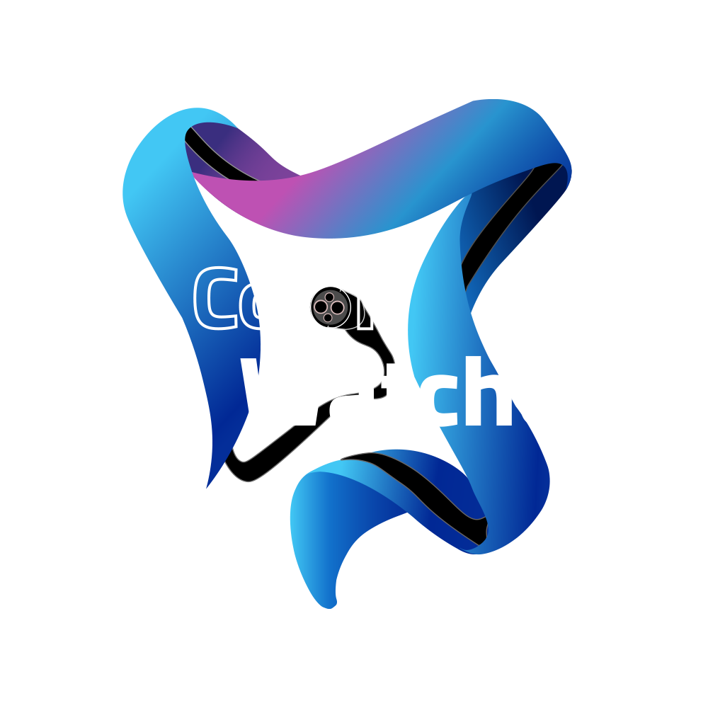
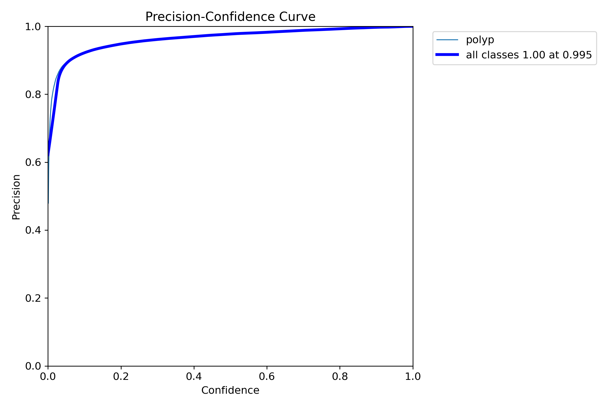
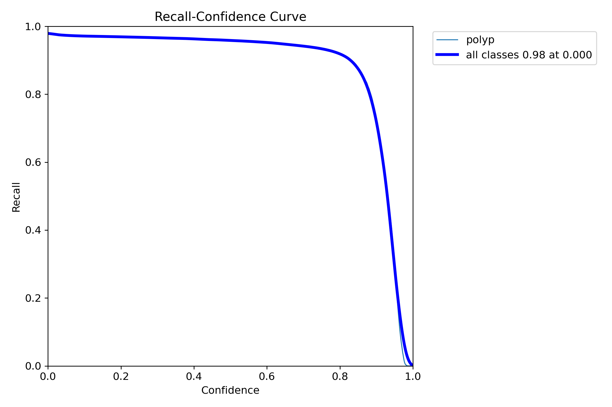
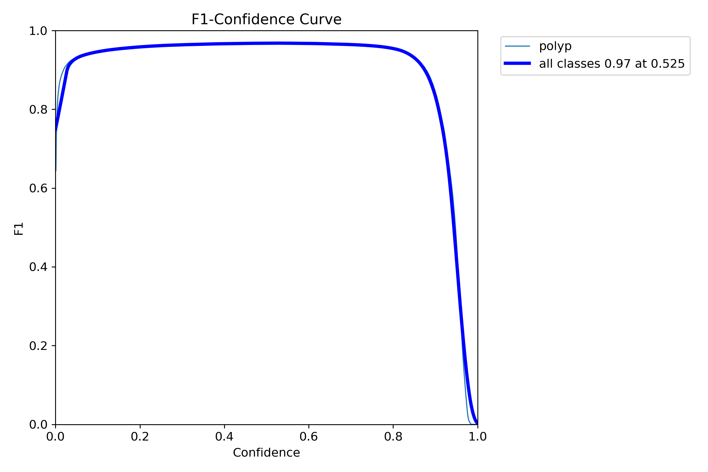
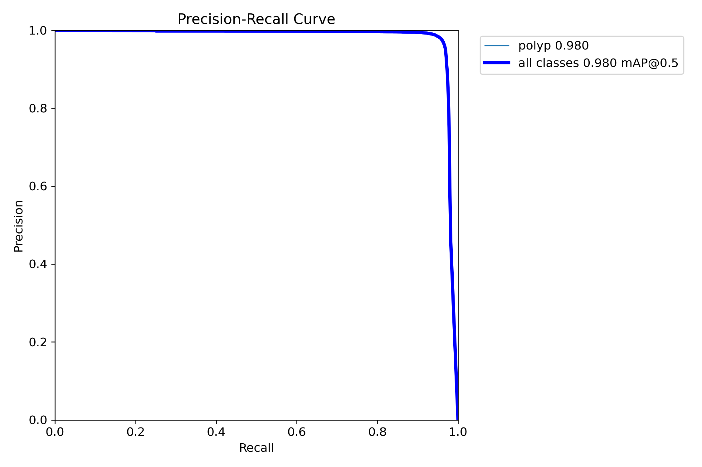
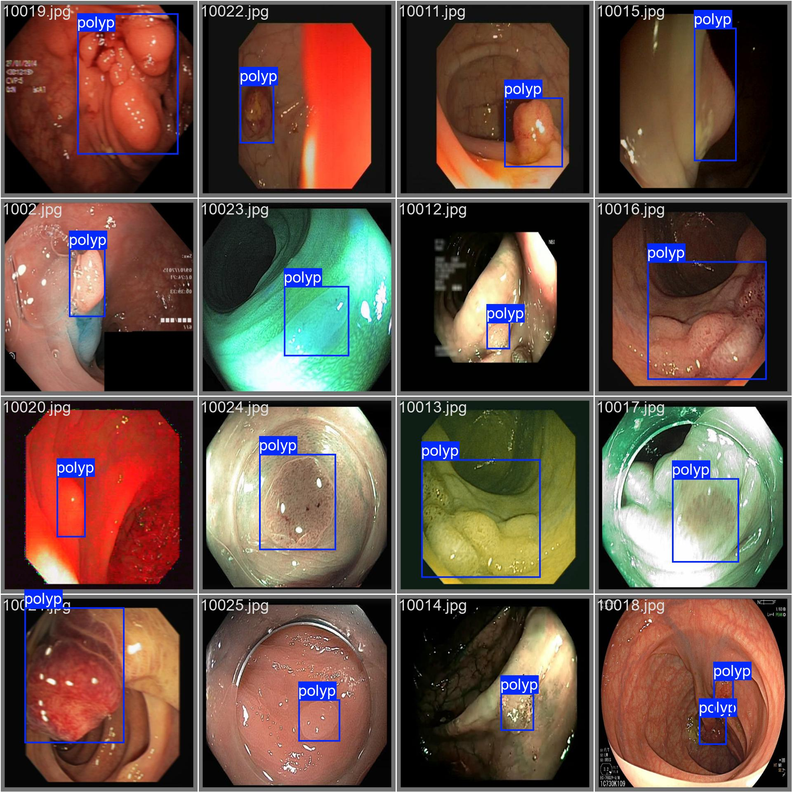

# Colon Watcher

<p align="center">
  
</p>

A real-time polyp detection system for colonoscopy procedures. **Colon Watcher** leverages **YOLOv10b** for object detection and uses **ZenML** pipelines to manage the data cleaning, training, and deployment workflow. A **FastAPI** service is provided for model inference, and a **Docker** configuration is included for easy containerization and deployment.

---

## Table of Contents

1. [Overview](#overview)
2. [Project Structure](#project-structure)
3. [Dataset](#dataset)
4. [Model Training](#model-training)
5. [Pipeline (ZenML)](#pipeline-zenml)
6. [API (FastAPI)](#api-fastapi)
7. [Docker](#docker)
8. [Evaluation Metrics](#evaluation-metrics)
9. [How the Model Works](#how-the-model-works)
10. [Setup & Usage](#setup--usage)
11. [License](#license)
12. [References](#references)


---

## Overview

**Colon Watcher** aims to assist gastroenterologists by detecting polyps in real-time during colonoscopy procedures. By using **YOLOv10b**:

- **Data Cleaning & Augmentation**: Preprocesses colonoscopy images to ensure quality input for the model.
- **Model Training**: Uses YOLOv10b for robust polyp detection.
- **Deployment**: Provides a FastAPI endpoint for real-time inference and a Docker configuration for easy deployment.

---

## Project Structure

```bash
colon_watcher/
├── api
│   ├── client.py                 # Example client for testing the FastAPI service
│   └── main.py                   # Main entry point (FastAPI app)
├── data/                     # Raw and processed data
│   └── dataset              # processed dataset
├── pipelines/
│   ├── training_pipeline
│   │   └──training_pipeline.py  # ZenML pipeline definition for training
├── saved_models/
│   └── p_best.pt             # Trained YOLOv10b model checkpoint
├── steps/
│   ├── clean_dataset_dataset
│   │   └── clean_dataset_dataset.py      # Data cleaning step
│   ├── clean_larib_polyp_dataset
│   │   └── clean_larib_polyp_dataset.py  # Data cleaning step (specific dataset)
│   ├── clean_neopolyp_dataset
│   │   └── clean_neopolyp_dataset.py     # Data cleaning step (specific dataset)
│   ├── ...
│   ├── create_yaml_file
│   │   └── create_yaml_file.py           # Step for creating YOLO config .yaml
│   ├── train_model
│   │   └── train_model.py                # Model training step
├── utils/
│   ├── annotation_utils.py           # Helper functions for annotation
│   ├── dataset_processor.py          # Dataset processing functions
│   ├── image_utils.py                # Image processing utilities
│   └─ utils_functions.py            # General utility functions
├── .dockerignore
├── Dockerfile
├── requirements.txt
└── run_pipeline.py           # Script to run the ZenML pipeline
```

---

## Dataset

Below is a some free datasets used, can be downloaded.

| Dataset Name                        | Size    | Link                                                                                                                                |
|-------------------------------------|---------|-------------------------------------------------------------------------------------------------------------------------------------|
| **ETIS-LaribPolypDB**               | ~161 MB | [Dataset Link](https://www.dropbox.com/scl/fi/aadlikkplxmrmak9hheyd/ETIS-LaribPolypDB.rar?dl=0&e=1&rlkey=xj8664dirt0ah6nqm1yi8kwdu) |
| **normal-20220907T124623Z-001**     | ~775 MB | [Dataset Link](https://zenodo.org/records/7101479)                                                                                  |
| **PolypGen2021_MultiCenterData_v3** | ~3.2 GB | [Dataset Link](https://www.synapse.org/Synapse:syn45200214)                                                                         |
| **PolypsSet**                       | ~2.3 GB | [Dataset Link](https://dataverse.harvard.edu/dataset.xhtml?persistentId=doi:10.7910/DVN/FCBUOR)                                     |
| **DataSet_**                        | ~556 MB | [Dataset Link](https://figshare.com/articles/figure/Polyp_DataSet_zip/21221579?file=37636550)                                       |
| **NeoPolyp**                        | ~375 MB | [Dataset Link](https://www.kaggle.com/c/bkai-igh-neopolyp/data?select=train)                                                        |

After download data put it into data directory and there are helper function to clean and augmentation any dataset in utils.

---

## Model Training

1. **Preprocessing**: Each dataset undergoes cleaning and formatting steps found in `steps/clean_*_dataset.py`.
2. **Configuration**: A YAML file is created to configure YOLO’s hyperparameters (`steps/create_yaml_file.py`).
3. **Training**: The `train_model.py` step uses YOLOv10b to train on the cleaned datasets.
4. **Model Artifacts**: The best-performing model checkpoint (`p_best.pt`) is saved in the `saved_models/` directory.


### Training Environment
 
The model was trained using Google Colab to leverage free GPU resources for faster training.


---

## Pipeline (ZenML)

ZenML orchestrates the entire pipeline:

- **Data Cleaning Steps**: `clean_dataset_dataset.py`, `clean_larib_polyp_dataset.py`, etc.
- **Training Step**: `train_model.py`
- **Evaluation Step** (optional): Evaluate model performance, produce metrics, or generate visualizations.

You can run the pipeline using:
```bash
zenml pipeline run training_pipeline
```
Or via the provided script:
```bash
python run_pipeline.py
```

---

## API (FastAPI)

A simple **FastAPI** application is provided in `main.py`:
- **Endpoints**:
  - `POST /predict`: Accepts an image and returns the detection results (polyp bounding boxes, confidence scores, class name).

You can run the FastAPI server locally with:
```bash
uvicorn api.main:app --reload
```
Then access the docs at [http://127.0.0.1:8000/docs](http://127.0.0.1:8000/docs).

---

## Docker

A `Dockerfile` is provided for containerizing the FastAPI service with the trained model:

1. **Build the image**:
   ```bash
   docker build -t colon_watcher:latest .
   ```
2. **Run the container**:
   ```bash
   docker run -p 8000:8000 colon_watcher:latest
   ```
3. Access the API at [http://localhost:8000/docs](http://localhost:8000/docs).

---

## Evaluation Metrics


<table>
  <tr>
    <td></td>
    <td></td>
  </tr>
  <tr>
    <td></td>
    <td></td>
  </tr>
</table>

| Metric              | Value |
|---------------------|-------|
| **mAP@0.5**         | 0.98  |
| **Precision**       | 0.995 |
| **Recall**          | 0.98  |
| **F1-Score**        | 0.97  |

---

## How the Model Works


  PLACEHOLDER FOR MODEL DIAGRAM OR FLOWCHART
  Add an image or diagram illustrating how the model processes an input image and outputs detection results.
  
  Example:
  
  <p align="center">
    
  </p>


1. **Input**: Colonoscopy video frames or images.
2. **YOLOv10b Inference**: Model processes the frames to detect polyp bounding boxes and confidence scores.
3. **Output**: Visualization of bounding boxes overlaid on the original frames in real-time.

---

## Setup & Usage

1. **Clone the Repository**:
   ```bash
   git clone https://github.com/Abdallah2A/Colon-Watcher.git
   ```
2. **Install Dependencies**:
   ```bash
   cd colon_watcher
   pip install -r requirements.txt
   ```
3. **Configure ZenML** (if not already installed):
   ```bash
   zenml init
   ```
4. **Run the Pipeline**:
   ```bash
   python run_pipeline.py
   ```
5. **Start the FastAPI Service**:
   ```bash
   uvicorn api/main:app --reload
   ```
6. **Test the Inference**:
   - Use the provided `api/client.py` or any HTTP client (e.g., cURL, Postman) to send requests to `POST /predict`.

---

## License

This project is free to use.

---

## References

- [YOLOv10b](https://github.com/ultralytics/ultralytics) - Official YOLO repository.
- [ZenML](https://docs.zenml.io/) - MLOps framework for building portable, production-ready MLOps pipelines.
- [FastAPI](https://fastapi.tiangolo.com/) - Modern, fast (high-performance) web framework for building APIs with Python.
- [Docker](https://www.docker.com/) - Container platform for packaging and deploying applications.

---

Enjoy using **Colon Watcher** and happy polyp detecting!
